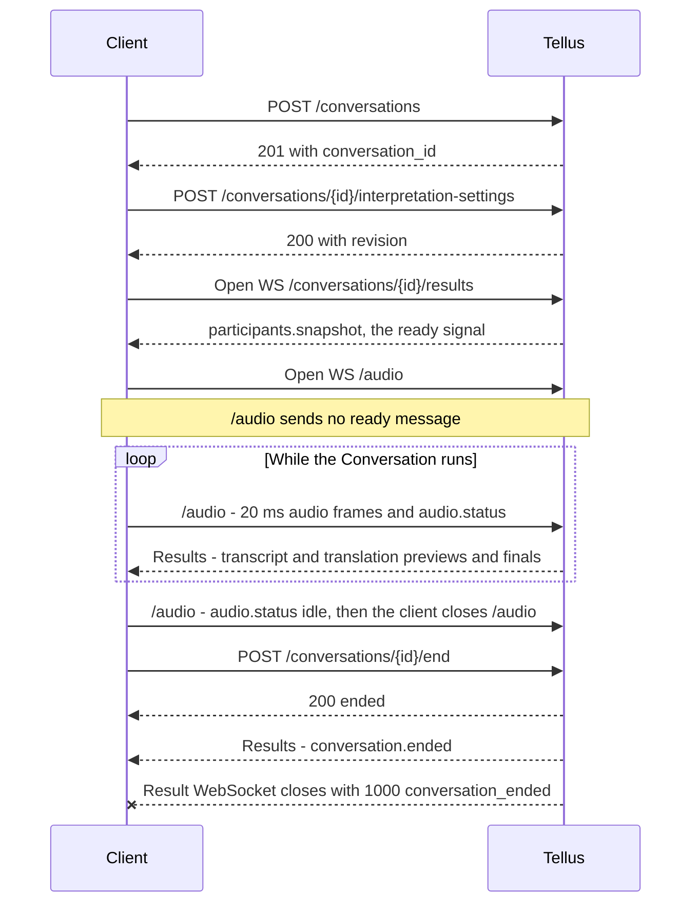
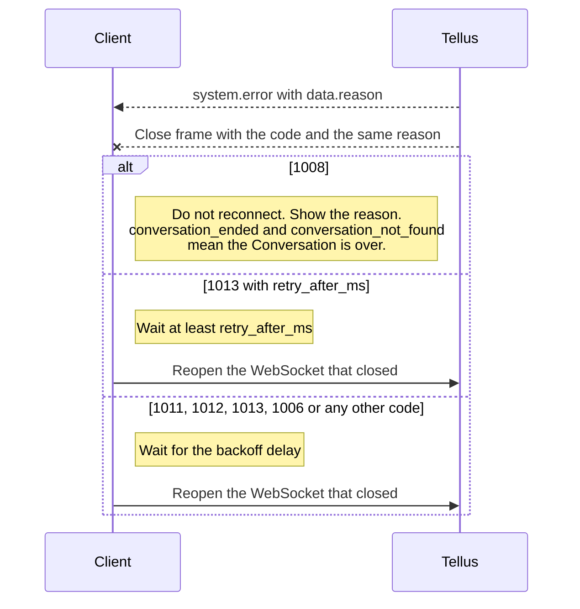
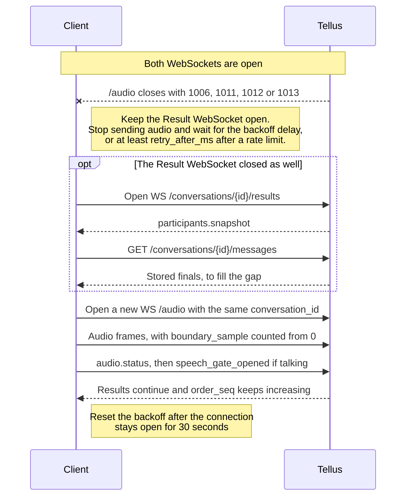
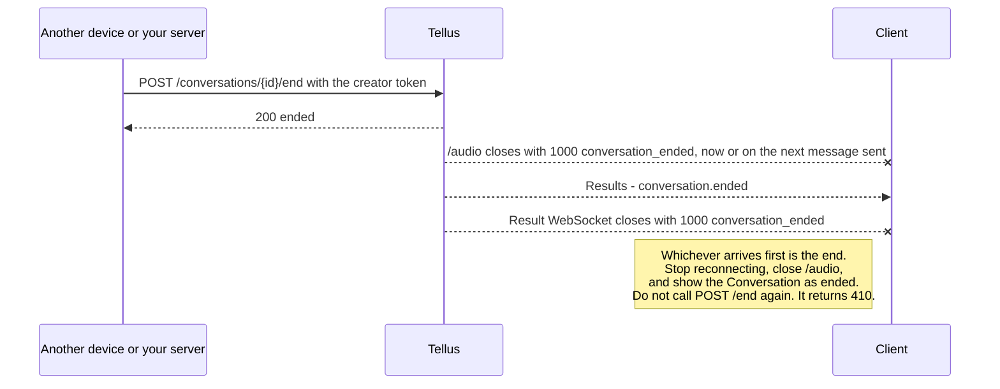

# Tellus realtime translation examples

Standalone realtime translation examples that can be copied and used independently.

- [`web/`](./web/README.md): Vite + React web example
- [`mobile/`](./mobile/README.md): Expo + React Native mobile example
- [`desktop/`](./desktop/README.md): Electron desktop example using the Tellus native audio engine

None of the apps depend on local Realtime Speech server code. All of them connect directly to the staging server below.

- HTTP: `https://stgrtsapi.tellus.ai.kr`
- WebSocket: `wss://stgrtsapi.tellus.ai.kr`

Each app has its own packages and realtime communication implementation, with no imports between them.
Each app reads `API_KEY` from its local `.env` file and uses it in the
`Authorization: Bearer <token>` header.

## API contract

The examples follow the Realtime Speech API documented in Swagger. This section
summarizes that documentation; Swagger is the reference.

- Swagger UI: `https://stgrtsapi.tellus.ai.kr/docs`
- OpenAPI document: `https://stgrtsapi.tellus.ai.kr/openapi.json`

The **Integration Guide** at the top of the Swagger page covers one
Conversation from creation to end: the calls to make, what the server sends,
and what a client should do when a connection closes. The WebSocket routes are
described at the end of the Swagger description, because OpenAPI lists only
HTTP operations.

### Base URLs and authentication

- HTTP base URL: `https://stgrtsapi.tellus.ai.kr`
- WebSocket base URL: `wss://stgrtsapi.tellus.ai.kr`
- The REST endpoints require `Authorization: Bearer <OAuth access token>`.
  Creating a Conversation makes the authenticated user its creator; guest
  tokens are rejected. A missing, invalid, or expired token returns `401`:
  refresh the token and retry once.
- The browser/mobile WebSocket flow does not send an Authorization header or auth frame; the
  server confirms that the Conversation is active. The desktop native engine additionally sends
  `audio.authenticate` and `engine.renew` on `/audio` to obtain and renew its execution permit.
- If the web origin is not registered, a WebSocket closes with `1008`
  `origin_not_allowed`. Ask Tellus to register your origin.

### Conversation flow

A Conversation uses three REST calls and two WebSockets. After a disconnect, a
client reopens only the WebSockets.



The other cases have their own diagrams below: an
[error close](#close-codes-and-recommended-client-behavior), a
[reconnect](#reconnecting-after-a-disconnect), and a Conversation
[ended from the Tellus side](#ending-a-conversation).

- Save interpretation settings before opening `/audio`. Otherwise `/audio`
  closes with `1008` `interpretation_settings_not_found`.
- Open the Result WebSocket first and wait for `participants.snapshot` before
  opening `/audio`. The Result WebSocket does not resend results produced
  before it connected.
- Do not save interpretation settings again during a Conversation. Settings
  take effect only when the Conversation's interpretation worker starts. Saving
  again does not change the running worker, and the next `/audio` connection
  can close with `1008` `interpretation_settings_changed`. To change languages,
  create a new Conversation; see
  [Changing languages during a Conversation](#changing-languages-during-a-conversation).
- The Result WebSocket is receive-only. Any message the client sends on it
  closes it with `1008`. There is no leave message; to leave, close both
  WebSockets.
- Closing WebSockets does not end a Conversation. Only
  `POST /conversations/{id}/end` ends it.

### REST endpoints

HTTP responses use a common envelope. In errors, `message[0]` is English and
`message[1]`, when present, is Korean.

```json
{"statusCode": "404", "message": ["Conversation not found.", "대화를 찾을 수 없습니다."], "data": {}}
```

The same rules apply to every endpoint. The response has no `Retry-After`
header; use the [backoff](#close-codes-and-recommended-client-behavior) below.

| Status | Meaning | Retry |
| --- | --- | --- |
| `400` | The request is not valid. | No; fix the request. |
| `401` | The access token is missing, invalid, or expired. | Once, after refreshing the token. |
| `403` | The user is not the Conversation creator, or the token is a guest token. | No. |
| `404` | The Conversation does not exist, or its state expired 24 hours after creation. | No. |
| `410` | The Conversation has ended. | No. For `/end`, treat it as success. |
| `412` | Another settings save changed `revision` at the same time. | Once, after reading the settings again. |
| `500` | Unexpected server error. | Not automatically. Report the `conversation_id` to Tellus if it repeats. |
| `503` | Temporarily unavailable. | Yes, with backoff. |
| No response | The network failed or the request timed out. | `GET /messages` and `POST /end`: yes, with backoff. The other calls: not automatically, because the request may have been applied. |

#### `POST /conversations`

Create a Conversation. The operation ID is `createConversation`, and the
success status is `201`.

Request:

```json
{
  "max_concurrent_viewers": 10,
  "conversation_audio_mode": "single_speaker"
}
```

- `max_concurrent_viewers`: required integer, `1..10`
- `conversation_audio_mode`: `single_speaker` or `multi_speaker`; defaults to
  `single_speaker`

Shape of `data` in a successful response:

```json
{
  "conversation_id": "conversation-1",
  "conversation_audio_mode": "single_speaker",
  "max_concurrent_viewers": 10
}
```

| Status | Meaning |
| --- | --- |
| `400` | Invalid request body, for example a missing or out-of-range `max_concurrent_viewers`. Fix the request; do not retry. |
| `401` | The access token is missing, invalid, or expired. Refresh the token and retry once. |
| `403` | Guest tokens cannot create a Conversation. |
| `503` | Temporarily unavailable. Retry with backoff. |

#### `POST /conversations/{conversation_id}/interpretation-settings`

Save the Conversation's interpretation settings. Creator access is required.
The operation ID is `saveInterpretationSettings`, and the success status is
`200`.

Save once, before opening `/audio`; until settings exist, `/audio` closes with
`1008` `interpretation_settings_not_found`. Each save increments `revision` and
replaces the whole settings object. Settings take effect when the
Conversation's interpretation worker starts, so saving again during a
Conversation does not change a running worker; see
[Changing languages during a Conversation](#changing-languages-during-a-conversation).

Request:

```json
{
  "languages": ["ko-KR", "en-US"],
  "transcription": {
    "client_vad": true
  }
}
```

| Field | Required | Description |
| --- | --- | --- |
| `languages` | yes | Active BCP 47 languages, 1 or 2 unique values. One language means transcription only; two languages enable translation with server defaults. |
| `text_to_speech_enabled` | no | Generate TTS audio for final translations. Defaults to `false`. |
| `transcription.client_vad` | no | When `true`, the server uses `audio.status.vad.event` as the speech boundary control signal: `speech_gate_opened` re-arms the boundary and `speech_gate_closed` requests utterance finalization. When `false` (default), server-side VAD is the boundary source. |
| `transcription.audio_format` | no | `opus` (default) or `pcm_s16le`. |
| `transcription.sample_rate` | no | `16000`. |
| `transcription.num_channels` | no | `1`. |
| `transcription.speech_end_detection` | no | `max_delay_ms` (`500..3000`, default `2000`), `finalization_bias` (`-1.0..1.0`, default `-0.5`), `finalization_speed_level` (`0..3`, default `0`). |

Supported languages: `ko-KR`, `en-US`, `en-GB`, `en-AU`, `en-IN`, `ja-JP`,
`zh-CN`, `zh-TW`, `yue-HK`, `es-ES`, `es-MX`, `es-US`, `fr-FR`, `fr-CA`,
`de-DE`, `vi-VN`, `pl-PL`, `th-TH`, `ru-RU`, `it-IT`, `id-ID`, `fil-PH`.

Shape of `data` in a successful response:

```json
{
  "conversation_id": "conversation-1",
  "languages": ["ko-KR", "en-US"],
  "text_to_speech_enabled": false,
  "transcription": {
    "audio_format": "opus",
    "sample_rate": 16000,
    "num_channels": 1,
    "client_vad": true,
    "speech_end_detection": null
  },
  "revision": 1
}
```

| Status | Meaning |
| --- | --- |
| `400` | Invalid request body, unsupported language, or invalid transcription options. Fix the request; do not retry. |
| `401` | The access token is missing, invalid, or expired. Refresh the token and retry once. |
| `403` | The authenticated user is not the Conversation creator, or the token is a guest token. |
| `404` | The Conversation does not exist (or its state expired 24 hours after creation). |
| `410` | The Conversation has ended. |
| `412` | Another save changed the settings `revision` at the same time. Read the settings again, then save once more. |
| `503` | Temporarily unavailable. Retry with backoff. |

#### `POST /conversations/{conversation_id}/end`

End the Conversation. Creator access is required. The operation ID is
`endConversation`, and the success status is `200`. There is no request body.

The server closes `/audio`, then sends `conversation.ended` on the Result
WebSocket and closes it with `1000`. The HTTP response and
`conversation.ended` can arrive in either order; keep the Result WebSocket open
until `conversation.ended` arrives.

This call is not idempotent: a second call returns `410`, which means the
Conversation has already ended. Call it on every exit path. A Conversation that
is never ended stays open until its state expires 24 hours after creation, and
after that it can no longer be ended.

Shape of `data` in a successful response:

```json
{
  "conversation_id": "conversation-1",
  "ended": true
}
```

| Status | Meaning |
| --- | --- |
| `401` | The access token is missing, invalid, or expired. Refresh the token and retry once. |
| `403` | The authenticated user is not the Conversation creator. |
| `404` | The Conversation does not exist, or its state expired 24 hours after creation. It can no longer be ended. |
| `410` | The Conversation has already ended. Treat this as success. |
| `503` | Temporarily unavailable. The Conversation stays open, and new `/audio` connections may be rejected until this call succeeds. Call again. |

#### `GET /conversations/{conversation_id}/messages`

Return the Conversation's stored final results, ordered by `message_seq`.
Creator access is required. Previews are not stored.

Each page has at most `limit` messages (`1..100`, default `100`) and starts
from the first one. Omit `after_message_seq` for the first page (`0` is
rejected); while `has_more` is `true`, call again with
`after_message_seq=<next_after_message_seq>`. History stays available after the
Conversation ends, until its state expires 24 hours after creation.

Shape of `data` in a successful response:

```json
{
  "messages": [
    {
      "message_seq": 1041,
      "order_seq": 0,
      "transcript": "안녕하세요.",
      "source_language": "ko-KR",
      "translation": "Hello.",
      "target_language": "en-US",
      "start_at": 1000,
      "end_at": 2000
    },
    {
      "message_seq": 1042,
      "order_seq": 1,
      "transcript": "반갑습니다.",
      "source_language": "ko-KR",
      "translation": null,
      "target_language": null,
      "start_at": 2400,
      "end_at": 3100
    }
  ],
  "next_after_message_seq": null,
  "has_more": false
}
```

One message is one utterance: `order_seq` is the same value as in its `result`
events, `transcript` is its `transcript.final` text, and `translation` with
`target_language` is its `translation.final`. A message also carries `chat_id`
(the `conversation_id`), `user_id`, `transcript_confidence`, `voice_url`, and
`created_at`. Result events carry no `message_seq`, so page from the start
every time.

Use this to fill finals missed while the Result WebSocket was disconnected:

- Merge by `order_seq`, one part at a time. A client can already have the
  transcript of an utterance and still miss its translation, so do not skip a
  message only because its `order_seq` is known.
- A final published moments ago may not be stored yet, and `translation` is
  added to its message after the transcript. Fetch again a few seconds later if
  the newest utterances are missing or have no translation.

| Status | Meaning |
| --- | --- |
| `400` | Invalid `limit` or `after_message_seq`. |
| `401` | The access token is missing, invalid, or expired. Refresh the token and retry once. |
| `403` | The authenticated user is not the Conversation creator, or the token is a guest token. |
| `404` | The Conversation does not exist, or its state expired 24 hours after creation. |
| `503` | Temporarily unavailable. Retry with backoff. |

### Result WebSocket

Endpoint:

```text
wss://stgrtsapi.tellus.ai.kr/conversations/{conversation_id}/results
```

Receive transcripts, translations, presence, and the end of the Conversation.
Open this before `/audio`.

- Do not add query parameters; an unexpected query parameter closes the socket
  with `1008` `invalid_query_parameter`.
- This WebSocket is receive-only; any text or binary message from the client
  closes it with `1008` `result_socket_read_only`. There is no leave message.
- The first message after the connection is accepted is
  `participants.snapshot`. Treat it as the ready signal and open `/audio`
  after it.
- The endpoint does not replay earlier results, including after a reconnect.
  Fetch stored finals with `GET /conversations/{conversation_id}/messages`;
  previews are not stored.
- The server sends `participants.snapshot`, `participant.joined` /
  `participant.left` presence events, `result` events,
  `interpretation_settings.updated` control events, `tts.completed` audio
  events, `conversation.ended`, and `system.error` before most error closes.
  The examples handle `participants.snapshot`, `result`, `conversation.ended`,
  and `system.error`.
- If the server cannot deliver a message on this socket, it closes it with
  `1013` `result_send_failed` and no `system.error`. Reconnect with backoff and
  fill the gap from the History API.

Result message example:

```json
{
  "type": "result",
  "statusCode": "200",
  "message": ["ok"],
  "data": {
    "conversation_id": "conversation-1",
    "stream_id": "conversation-1:speaker-1:1",
    "participant_id": "speaker-1",
    "event_type": "transcript.preview",
    "order_seq": 2,
    "text": "안녕하세요.",
    "source_language": "ko-KR",
    "target_language": "en-US"
  }
}
```

| Field | Description |
| --- | --- |
| `data.event_type` | `transcript.preview`, `transcript.final`, `translation.preview`, or `translation.final`. |
| `data.order_seq` | Conversation-global utterance order, starting at 0. It is allocated monotonically and never reused across audio reconnects or worker/process restarts. The same utterance keeps this value across transcript/translation preview and final events. |
| `data.stream_id` | Speaker uplink and pipeline epoch stream ID. It changes on every `/audio` reconnect. |
| `data.start_at`, `data.end_at` | Audio timeline start and end times in milliseconds for final results; preview messages may omit them. |
| `data.participant` | Optional participant profile metadata. |

Client handling rules:

- Use only the `data.event_type` prefix to distinguish transcript from
  translation, and only its suffix to distinguish preview from final.
- De-duplicate transcripts by `data.order_seq` + `data.event_type`; include
  `data.target_language` for translations.
- Group the transcript and translation of the same utterance with
  `data.order_seq`; it is conversation-global and does not reset when
  `stream_id` changes. It starts at 0, so do not test it for truthiness.
- Treat any envelope whose top-level `type` is not `result` as control or error
  data.

When the Creator ends the Conversation, the server closes `/audio`, then sends
`conversation.ended` and closes this socket with `1000` `conversation_ended`.
Treat `conversation.ended` or `1000` as the end of the Conversation and do not
reconnect.

```json
{
  "type": "conversation.ended",
  "data": {
    "conversation_id": "conversation-1",
    "ended_by_user_id": "7",
    "ended_at": 1800000035000
  }
}
```

`system.error` is sent on the same socket right before an error close.
`statusCode` is the close code that follows. `data.reason` is a stable code,
and the close frame repeats it as its reason text (`CloseEvent.reason`).
`message` is for display. `data` may also contain `conversation_id` and
`retry_after_ms`.

```json
{
  "type": "system.error",
  "statusCode": "1013",
  "message": ["Audio pipeline reconnect rate limit exceeded."],
  "data": {
    "conversation_id": "conversation-1",
    "reason": "audio_pipeline_activation_rate_limited",
    "retry_after_ms": 800
  }
}
```

| Reason | Code | Meaning | Retry |
| --- | --- | --- | --- |
| `conversation_ended` | `1000` | The Conversation ended while this socket was open. Follows `conversation.ended`; no `system.error`. | No; treat as ended. |
| `conversation_ended`, `conversation_not_found` | `1008` | The Conversation had already ended, or does not exist, when connecting. | No; treat as ended. |
| `origin_not_allowed` | `1008` | The web origin is not registered. | No; ask Tellus to register the origin. |
| `invalid_query_parameter` | `1008` | The URL has a query parameter. | No; fix the URL. |
| `result_socket_read_only` | `1008` | The client sent a message. | No; do not send on this socket. |
| `conversation_creator_missing` | `1008` | The Conversation record has no creator. | No; create a new Conversation. |
| `internal_error` | `1011` | Unexpected server error. | Yes, with backoff. |
| `temporarily_unavailable`, `result_stream_bus_subscription_timeout` | `1013` | Conversation state or result delivery is temporarily unavailable. The second reason can arrive several seconds after the socket opens, before `participants.snapshot`. | Yes, with backoff. |
| `result_send_failed` | `1013` | The server could not deliver a message. No `system.error`. | Yes, with backoff; fill the gap from the History API. |

### Audio WebSocket

Endpoint:

```text
wss://stgrtsapi.tellus.ai.kr/audio?conversation_id={conversation_id}&audio_format={opus|pcm16}
```

Stream one speaker's audio into a Conversation. Save interpretation settings
and open the Result WebSocket first.

| Query parameter | Required | Default | Values |
| --- | --- | --- | --- |
| `conversation_id` | yes | - | - |
| `audio_format` | no | `opus` | `pcm16`, `opus` |

- The client sends binary audio frames in the `audio_format` of the URL, text
  JSON `audio.status` messages for microphone and client VAD state, and
  optional `audio.discontinuity` messages when captured audio was dropped.
- Send one 20 ms frame per binary message: a raw Opus packet with no Ogg or
  WebM container, or with `audio_format=pcm16` exactly 640 bytes of 16 kHz mono
  signed 16-bit little-endian PCM. Audio in another shape, such as recorder
  chunks in a container, is accepted but produces no results and no error. The
  `/audio` query alone selects the decoding format.
- The server sends nothing on success: no ready message and no
  acknowledgement. It sends `system.error` before most error closes. Results
  arrive on the Result WebSocket.
- Binary audio may be the first message; no status is required before it. An
  `audio.status` that arrives before the first audio frame of a socket may be
  ignored, so send `speech_gate_opened` only after audio has started on that
  socket.
- The examples send 16 kHz mono audio in 20 ms frames. Web sends Opus at
  64 kbps when WebCodecs `AudioEncoder` and `AudioData` are available, and
  PCM16 otherwise. Mobile sends PCM16. Desktop sends Opus at 64 kbps from the
  native audio engine.

Connection rules:

- Each connection replaces the speaker's previous `/audio` connection. Close
  the old socket yourself: on the same server instance it is not closed and its
  frames are ignored; on another instance it closes on its next message with
  `1008` `audio_connection_replaced`. A connection that loses a simultaneous
  race closes the same way. Do not reconnect a replaced socket: either you
  already opened the newer one, or another device or tab is using the
  Conversation.
- Reconnects are limited to five in a row, then one per second, per speaker.
  Over the limit the socket closes with `1013`
  `audio_pipeline_activation_rate_limited` and `data.retry_after_ms`.
- Audio sent while disconnected is not replayed. On a new socket,
  `boundary_sample` restarts at 0: it counts 16 kHz samples from the first
  audio frame sent on that socket.
- With `client_vad` true the speech gate starts closed on every socket: no
  audio is recognized until `speech_gate_opened` arrives with `mic.state`
  `capturing`. Audio sent while the gate is closed is discarded, apart from a
  short lead-in. Open the gate again after a pause and after every reconnect.
- Interpretation stops about 15 minutes after the last audio frame, without
  closing this socket or sending a message; audio sent later on the same socket
  produces no results. If no audio was sent for 10 minutes or longer,
  including pauses, reconnect `/audio` before sending again.
- When the Conversation ends, this socket closes with `1000`
  `conversation_ended` and no `system.error`. Depending on server
  configuration the close arrives right away or on the next message sent, so a
  socket that sends nothing can stay open. Use `conversation.ended` on the
  Result WebSocket as the end signal and close this socket yourself.
- `audio.discontinuity` is only logged. An invalid `audio.discontinuity`, or a
  text message with an unknown `type` or `version`, is ignored and does not
  close the socket.

#### `audio.status`

```json
{
  "type": "audio.status",
  "version": 1,
  "boundary_sample": 32000,
  "mic": { "state": "capturing" },
  "vad": {
    "enabled": true,
    "event": "speech_gate_closed"
  }
}
```

Every `audio.status` must carry `type`, `version`, `boundary_sample`,
`mic.state`, and `vad.enabled`, also when `client_vad` is false. A missing
field closes the socket with `1008` `invalid_audio_status`.

| Field | Description |
| --- | --- |
| `type` | Must be `audio.status`. |
| `version` | Must be `1`. |
| `status_seq` | Deprecated and optional. The server ignores this value and applies statuses in the order they arrive on the connection. |
| `boundary_sample` | Non-negative integer audio sample cursor where this status applies on the uplink timeline; a fractional value such as `320.0` is rejected. `sample` is accepted as an alias. |
| `mic.state` | `disabled`, `idle`, `capturing`, `paused`, `permission_denied`, or `error`. |
| `vad.enabled` | `true` when the client VAD detector is enabled. A `speech_gate_closed` event requests utterance finalization only when this is `true`. |
| `vad.event` | Optional speech gate transition event, sent only on gate transitions; omit or null it for ordinary status updates. |

With `client_vad` true, `vad.event` is the speech boundary control signal.
`speech_gate_opened` (with `mic.state` `capturing`) re-arms the speech boundary
at that boundary sample, and `speech_gate_closed` (with `mic.state`
`capturing` and `vad.enabled` true) requests utterance finalization at that
boundary sample. Send each event only when the client speech gate actually
transitions. Any other `vad` field, such as `gate` or `level`, is ignored.

| `data.reason` | Code | Meaning | Retry |
| --- | --- | --- | --- |
| `conversation_ended` | `1000` | The Conversation ended while this socket was open. No `system.error`. | No; treat as ended. |
| `conversation_ended`, `conversation_not_found` | `1008` | The Conversation had already ended, or does not exist, when connecting. | No; treat as ended. |
| `origin_not_allowed` | `1008` | The web origin is not registered. | No; ask Tellus to register the origin. |
| `interpretation_settings_not_found` | `1008` | Settings were not saved before connecting. | No; connect again after saving settings. |
| `invalid_query_parameter`, `unsupported_audio_format` | `1008` | The URL has an unexpected or malformed query parameter, or an unsupported `audio_format`. | No; fix the URL. |
| `invalid_audio_status` | `1008` | An `audio.status` message is not valid. `data.detail` names the field when a field has the wrong type or value. | No; fix the message. |
| `malformed_audio_control_json` | `1008` | A text message is not a JSON object. | No; fix the message. |
| `invalid_audio_control_identity` | `1008` | A text message has no string `type` or positive integer `version`. | No; fix the message. |
| `audio_connection_replaced` | `1008` | A newer `/audio` connection for the same speaker replaced this socket. | No; ignore it if you opened the newer socket, otherwise tell the user. |
| `interpretation_settings_changed` | `1008` | Settings were saved again while the earlier interpretation worker runs. | No; create a new Conversation. |
| `conversation_creator_missing` | `1008` | The Conversation record has no creator. | No; create a new Conversation. |
| `invalid_request` | `1008` | Any other invalid request. | No; fix the client request. |
| `audio_pipeline_activation_rate_limited` | `1013` | Too many reconnects for this speaker. | After `data.retry_after_ms`. |
| `worker_capacity_exceeded`, `audio_uplink_dependency_unavailable`, `pipeline_epoch_allocation_failed`, `temporarily_unavailable` | `1013` | No worker capacity or a temporary storage failure. | Yes, with backoff. |
| `participant_audio_cursor_conflict`, `participant_audio_cursor_corrupt` | `1011` | Server-side audio state error. | Yes, with backoff; report the `conversation_id` if it repeats. |
| `worker_bootstrap_failed`, `internal_error` | `1011` | The interpretation worker could not start, or an unexpected server error. | Yes, with backoff; report the `conversation_id` if it repeats. |

The desktop example also sends `audio.authenticate` and `engine.renew` on this
socket. Those requests have their own `engine_*` close reasons, listed in the
[desktop README](./desktop/README.md#error-handling-and-reconnects). One of
them, `engine_authorization_expired`, is the only `1008` that the desktop
example answers with a reconnect: a new `/audio` socket is authorized again
from the start.

### Close codes and recommended client behavior

Decide whether to reconnect from the close code alone:

- `1000`: the Conversation ended. Do not reconnect.
- `1008`: do not reconnect. Show the reason.
- Any other code: reconnect with backoff.



Every `system.error` carries `data.reason`, and the close frame repeats the
same value as its reason text, so `CloseEvent.reason` is enough to tell why a
socket closed. Use the reason and `message` for display and logs, and the
close code for the decision. No `system.error` precedes `1000`, `1012`, a
`1011` caused by a missing pong, a `1013` `result_send_failed`, or a `1006`.
`1012` and `1006` carry no close reason either.

| Code | Reason | When | Socket | Retry | Client action |
| --- | --- | --- | --- | --- | --- |
| `1000` | `conversation_ended` | The Conversation ended with `POST /end` while the socket was open. The Result WebSocket closes right after `conversation.ended`. | both | no | Show the Conversation as ended. |
| `1008` | `conversation_ended`, `conversation_not_found` | Connecting to a Conversation that has already ended or does not exist (including the 24-hour expiry below). | both | no | Show the Conversation as ended. Create a new Conversation to continue. |
| `1008` | `origin_not_allowed` | The web origin is not registered. | both | no | Ask Tellus to register your origin. |
| `1008` | `invalid_query_parameter`, `unsupported_audio_format` | The connection URL has an unexpected or malformed query parameter, or an unsupported `audio_format`. | both | no | Fix the URL. |
| `1008` | `invalid_audio_status`, `malformed_audio_control_json`, `invalid_audio_control_identity` | A text message sent on `/audio` is not valid. When a field has the wrong type or value, `invalid_audio_status` carries `data.detail` naming the field. | `/audio` | no | Fix the message. |
| `1008` | `result_socket_read_only` | The client sent a message on the Result WebSocket. | Result | no | Do not send on this socket. |
| `1008` | `conversation_creator_missing` | The Conversation record has no creator. | both | no | Create a new Conversation and report the `conversation_id` to Tellus. |
| `1008` | `invalid_request` | Any other invalid request. | `/audio` | no | Fix the client request. |
| `1008` | `interpretation_settings_not_found` | `/audio` opened before settings were saved. | `/audio` | no | Save settings, then connect again. |
| `1008` | `interpretation_settings_changed` | Interpretation settings were saved again during the Conversation. | `/audio` | no | Create a new Conversation. Show `message`, which names the cause. |
| `1008` | `audio_connection_replaced` | A newer `/audio` connection for the same speaker replaced this socket. | `/audio` | no | If you opened the newer socket, ignore this close. Otherwise another device or tab is using the Conversation; tell the user. |
| `1011` | `internal_error`, `worker_bootstrap_failed`, `participant_audio_cursor_conflict`, `participant_audio_cursor_corrupt`; `keepalive ping timeout` for a missing pong | Internal server error, or no pong within 20 seconds of a ping. | both | yes, backoff | Back off and reconnect. Report the `conversation_id` to Tellus if it repeats. |
| `1012` | none | Server restart or redeploy. | both | yes, after a random 0.5–2 seconds | Wait a random 0.5–2 seconds, reconnect, then back off. |
| `1013` | `audio_pipeline_activation_rate_limited` | `/audio` reconnect rate limit, with `data.retry_after_ms`. | `/audio` | yes, after `retry_after_ms` | Wait at least `retry_after_ms`, then reconnect. |
| `1013` | `worker_capacity_exceeded`, `audio_uplink_dependency_unavailable`, `pipeline_epoch_allocation_failed`, `temporarily_unavailable`, `result_stream_bus_subscription_timeout` | Temporarily unavailable or no capacity. | both | yes, backoff | Back off and reconnect. |
| `1013` | `result_send_failed` | The server could not deliver a message on the Result WebSocket. | Result | yes, backoff | Back off and reconnect. Fill the gap from the History API. |
| `1006` | none | Seen by the client, not sent by the server: network loss or a stopped server process. | both | yes, backoff | Back off and reconnect. Retry at once on the browser `online` event. |

New reasons can be added. Handle an unknown reason by its close code.

**Backoff.** Wait 1, 2, 5, 10, and 30 seconds, then every 30 seconds. Reset the
attempt count only after a connection stays open for 30 seconds, because the
server can close a socket right after accepting it. With this schedule `/audio`
reconnects stay under the server limit of five in a row, then one per second,
per speaker.

**Node.js clients.** Use the [`ws`](https://github.com/websockets/ws) package
instead of the `WebSocket` built into Node.js, which is also the one in the
Electron main process. Against the staging server, the built-in client reports
an error close as `1006` with no message and no reason (observed with Node.js
22.19 and Electron 44.5), so every error close looks like a network drop and
the client keeps reconnecting. It loses a compressed message that is followed
at once by the close frame and the end of the connection. Chrome and `ws`
report the code, the reason, and the message.

Depending on server configuration, a settings change, missing worker capacity,
or a worker start failure can also happen without any close: the sockets stay
open but no results arrive. The result watchdog in
[Network loss and server failures](#network-loss-and-server-failures) covers
this case.

The three examples apply these rules. Each README describes what its example
does, and where the platform makes it differ, under
**Error Handling and Reconnects**:
[web](./web/README.md#error-handling-and-reconnects),
[mobile](./mobile/README.md#error-handling-and-reconnects),
[desktop](./desktop/README.md#error-handling-and-reconnects).

### Reconnecting after a disconnect

The server accepts a new `/audio` connection for the same `conversation_id` as
the continuation of the previous one. `order_seq` keeps increasing across
reconnects.



1. Reopen only the socket that closed. If both closed, open the Result
   WebSocket first and wait for `participants.snapshot`.
2. Remove the old socket's handlers and close it before opening the new one. A
   replaced `/audio` socket on the same server instance is not closed by the
   server; its frames are ignored. Ignore a late close from the old socket, for
   example `1008` `audio_connection_replaced`.
3. Do not save interpretation settings again. Every save increments
   `revision`, and the next `/audio` connection can then close with `1008`
   `interpretation_settings_changed`.
4. On a new `/audio` socket, count `boundary_sample` from 0 again. It is the
   16 kHz sample position counted from the first audio frame sent on that
   socket.
5. An `audio.status` that arrives before the first audio frame of the new
   socket may be ignored, so do not rely on one sent that early. With
   `client_vad: true`, reset the client VAD. The speech gate starts closed on
   every socket, so once audio is flowing and the speaker is talking, send
   `speech_gate_opened` again; otherwise that utterance is not recognized.
6. Audio from the disconnected period is not processed later. Drop it, or keep
   a short buffer (for example the last 0.5 seconds) and send it right after
   reconnecting.
7. Results are not sent again. A result with the same `order_seq` and
   `event_type` (and `target_language` for translations) replaces the earlier
   one. To fill finals missed during the gap, read
   `GET /conversations/{id}/messages` from the start: call it without
   `after_message_seq` and follow `next_after_message_seq` while `has_more` is
   true. Merge by `order_seq`, one part at a time: a History message holds
   both the transcript and the translation of an utterance, and a client can
   already have the transcript and still miss the translation. A final
   published moments ago may not be stored yet, and a translation is added to
   its message after the transcript, so fetch again a few seconds later.
   Previews are not stored.

### Ending a Conversation

`conversation.ended` is sent only after `POST /conversations/{id}/end`
succeeds with the creator's token, including when another device, tab, or your
server ends the Conversation. The server closes `/audio` first, then sends
`conversation.ended` on the Result WebSocket and closes it with `1000`.



- Treat whichever comes first as the end: `conversation.ended`, a Result
  `1000`, or an `/audio` `1000`. Stop reconnecting and close `/audio` yourself.
  A reconnect after the end is rejected with `1008` `conversation_ended`; treat
  that as the end too.
- Show the Conversation as ended, not as an error, and do not call `/end` again
  (it returns `410`).
- To end a Conversation yourself:
  1. Send `audio.status` with `mic.state` `paused` or `idle`. With
     `client_vad: true` and an open gate, send `speech_gate_closed` first.
  2. Wait briefly (for example 2 seconds) for the last final.
  3. Stop reconnecting, close `/audio`, and call `POST /end`. Call it again on
     `503`.
  4. Keep the Result WebSocket open until `conversation.ended` arrives. The
     HTTP `200` and `conversation.ended` can arrive in either order.

### Changing languages during a Conversation

A Conversation has one or two languages, and they are fixed when its
interpretation starts. Adding or changing a language during a Conversation is
not supported. To use other languages, end the Conversation and create a new
one.

- Saving interpretation settings again returns `200` and increments `revision`,
  even when nothing changed, but the interpretation that is already running
  keeps the languages it started with.
- `interpretation_settings.updated` on the Result WebSocket reports what was
  saved, not what the running interpretation uses. Do not read it as "the
  languages changed".
- After such a save, the next `/audio` connection can close with `1008`
  `interpretation_settings_changed`. Depending on server configuration it can
  also stay open; the new languages are still not used.
- A save replaces the whole settings object. Fields that are left out, such as
  `text_to_speech_enabled` and `transcription.client_vad`, return to their
  defaults.

**Captions from before the change.** They cannot be received in the new
language. Each utterance is translated once, when it is spoken, between the two
languages the Conversation has at that time, and the server does not translate
earlier utterances again.

What stays available is what was produced at the time: the transcripts and the
translations of the earlier Conversation, as finals, from
`GET /conversations/{id}/messages` with the creator's token. The new
Conversation has its own `conversation_id` and its own History, so keep the
earlier `conversation_id` if you want to show its captions next to the new
ones.

### Time limits and automatic stops

There is no maximum Conversation length, and the server never ends a
Conversation on its own.

| Limit | Value | When it passes | Recommendation |
| --- | --- | --- | --- |
| Conversation state retention | 24 hours after creation. Activity does not extend it. | New connections, settings, the History API, and `/end` are rejected with `404` or `1008` `conversation_not_found`. Open sockets stay open, but cannot reconnect after they close. | Create a new Conversation per session, end it within 24 hours, and read its History within that time. |
| No audio | About 15 minutes after the last audio frame; about 10 minutes when no audio was sent after `/audio` connected. | Interpretation stops silently. Sockets stay open and no message is sent, but audio sent afterwards produces no results. | If no audio was sent for 10 minutes or longer (including pauses), reconnect `/audio` before sending again. |
| WebSocket ping | Every 25 seconds; the server waits 20 seconds for the pong. | The server closes the socket with `1011` `keepalive ping timeout`. | Browsers answer pings automatically. Do not send application-level ping messages. |
| `/audio` reconnects | Five in a row, then one per second, per speaker. | `1013` `audio_pipeline_activation_rate_limited` with `retry_after_ms`. | Use the backoff above. |

- The server never closes a socket because no audio arrives. As long as pings
  are answered, both WebSockets stay open.
- The 15-minute rule counts audio frames only. Silent frames count as audio, so
  short gaps alone do not stop interpretation.
- A Conversation ends only with `POST /end`. If it is never called, the
  Conversation stays open, and after 24 hours `/end` also returns `404`, so it
  can no longer be ended or cleaned up. Call `/end` on every exit path,
  including app shutdown and fatal errors.

### Network loss and server failures

The Conversation and `order_seq` are kept in server storage. Within 24 hours of
creation, a client that reconnects with the same `conversation_id` continues
the Conversation after a network drop or a server restart.

| What happened | What the client sees | What to do |
| --- | --- | --- |
| Network loss, or the server process stopped | `1006` on both sockets, no message | Back off and reconnect. Reconnect at once on the browser `online` event. |
| Server restart or redeploy | `1012` on both sockets, no message | Wait a random 0.5–2 seconds, reconnect, then back off. |
| The server is temporarily overloaded or a dependency failed | `1011` or `1013`, usually after `system.error` | Back off and reconnect; after a rate limit wait at least `retry_after_ms`. |
| A REST call fails with `503` or gets no response | HTTP error | Retry a `503` with backoff. After no response, repeat only `GET /messages` and `POST /end`; a `POST /conversations` that got no response may have created a Conversation. |

After a reconnect the Conversation continues, with these limits:

- Results sent while the Result WebSocket was closed are not sent again. Fill
  the finals from the History API; previews are lost.
- Audio captured while `/audio` was closed is not processed.
- An utterance that was in progress when `/audio` dropped can end without a
  final. Speech after the reconnect starts a new utterance with a new
  `order_seq`.

**Detecting a broken connection**

- The server pings every 25 seconds, but browsers answer pings without
  notifying the app.
- On `/audio`, watch `bufferedAmount`. If unsent audio stays above about
  2 seconds of audio for more than 5 seconds, close the socket and reconnect.
  Two seconds is 64 KB for PCM16; for Opus it depends on the encoder bitrate
  (16 KB at 64 kbps).
- The Result WebSocket is silent while nobody speaks. Silence alone does not
  mean the socket is broken.
- On the browser `offline` event, wait. On `online`, reconnect at once instead
  of waiting for the backoff.
- Treat a connection attempt that does not open within 10 seconds as failed and
  move to the next backoff step.

**Results stop while the sockets stay open.** If interpretation stops or the
Result WebSocket silently breaks, the sockets can stay open with no results.
This happens after 15 minutes without audio, and also after temporary failures
in the speech engine or server storage, or because of server configuration.
The server sends no close or `system.error` in these cases, so add this
watchdog:

- If the speaker is talking (the client VAD reports speech or the input level
  is high) and no result, including `transcript.preview`, arrives for 20
  seconds, reconnect the Result WebSocket and then `/audio`.
- If results still do not arrive, try twice more at 20-second intervals. Then
  tell the user and report the `conversation_id` and the time to Tellus.

The examples do not include the `bufferedAmount` check, this watchdog, or the
reconnect after 10 minutes without audio. They reconnect only when a socket
closes, and they do not read the History API after a reconnect.

**Retrying and giving up**

- Use the backoff above.
- While retrying, show a neutral message such as "The realtime connection is
  unstable; reconnecting." A close code alone does not tell whether the user's
  network, a CDN, or the server caused the problem.
- If you cap automatic retries, let the user choose between trying again and
  ending when the cap is reached. If the user chooses to end, call `POST /end`.
